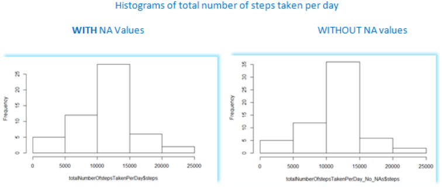

# Reproducible Research - Project 1
Helmar Martens  
October 4, 2016  


```
## Warning: package 'Hmisc' was built under R version 3.3.1
```

```
## Loading required package: lattice
```

```
## Loading required package: survival
```

```
## Warning: package 'survival' was built under R version 3.3.1
```

```
## Loading required package: Formula
```

```
## Loading required package: ggplot2
```

```
## Warning: package 'ggplot2' was built under R version 3.3.1
```

```
## 
## Attaching package: 'Hmisc'
```

```
## The following objects are masked from 'package:base':
## 
##     format.pval, round.POSIXt, trunc.POSIXt, units
```


# Loading and preprocessing the data


```r
#Load data from file
    activitiesFile <- "activity.csv"
    activities <- read.table(activitiesFile, header = TRUE, sep = ",")
# Convert date column from factor to Date data type    
    activities$date<-as.Date(as.character(activities$date))
```

# What is mean total number of steps taken per day?
#### 1. Calculate the total number of steps taken per day


```r
    totalNumberOfstepsTakenPerDay <- with(activities, aggregate(steps ~ date, FUN=sum))
```

#### 2. Make a histogram of the total number of steps taken each day 


```r
hist(totalNumberOfstepsTakenPerDay$steps)
```

<!-- -->

#### 3. Calculate and report the mean and median of the total number of steps taken per day


```r
# Calculate mean
meanTotalNumSteps   <- mean(totalNumberOfstepsTakenPerDay$steps)
# Calculate median
medianTotalNumSteps <- median(totalNumberOfstepsTakenPerDay$steps)
```

Answer) Mean of total number of steps taken per day:   1.0766\times 10^{4}

Answer) Median of total number of steps taken per day: 10765

# What is the average daily activity pattern?
#### 1. Make a time series plot (i.e. type = "l") of the 5-minute interval (x-axis) and the average number of steps taken, averaged across all days (y-axis)

```r
#Create a new dataset to hold the average number of steps taken per 5-minute interval accross all days
avgNumberOfStepsPerInterval <- with(activities, aggregate(steps ~ interval, FUN=mean))
# Create the time series plot
plot(steps ~ interval, data= avgNumberOfStepsPerInterval, type = "l")
```

<!-- -->

#### 2. Which 5-minute interval, on average across all the days in the dataset, contains the maximum number of steps?

```r
maximumNumberOfSteps <- subset(avgNumberOfStepsPerInterval, avgNumberOfStepsPerInterval$steps == max(avgNumberOfStepsPerInterval$steps, na.rm = TRUE))
```
Answer) Interval: 835

# Imputing missing values
#### 1. Calculate and report the total number of missing values in the dataset (i.e. the total number of rows with NAs)

```r
totalNumberOfNAs <-- sum(is.na(activities$steps))
```

Answer) Total number of missing values: -2304

#### 2. Devise a strategy for filling in all of the missing values in the dataset. The strategy does not need to be sophisticated. For example, you could use the mean/median for that day, or the mean for that 5-minute interval, etc.

The strategy is to use the "impute" function, which is part of the "Hmisc" package. We will fill all the missing values with the mean of the total number of steps across the entire dataset. 

#### 3. Create a new dataset that is equal to the original dataset but with the missing data filled in.

```r
# Make a copy of the current activities dataset.  Let's call it "activities_No_NAs"
activities_No_NAs <- activities
# Now call the impute function to fill in the NA values with the mean of steps across the entire datase.
activities_No_NAs$steps <- with(activities_No_NAs, round(impute(steps, mean)))
```


#### 4. Make a histogram of the total number of steps taken each day and Calculate and report the mean and median total number of steps taken per day. Do these values differ from the estimates from the first part of the assignment? What is the impact of imputing missing data on the estimates of the total daily number of steps?

Answer) Histogram of the total number of steps taken each day:

```r
totalNumberOfstepsTakenPerDay_No_NAs <- with(activities_No_NAs, aggregate(steps ~ date, FUN=sum))
    hist(totalNumberOfstepsTakenPerDay_No_NAs$steps)
```

<!-- -->


```r
# Mean of the total number of steps taken each day. 
meanTotalStepsPerDay_No_NA <- mean(totalNumberOfstepsTakenPerDay_No_NAs$steps)

# Medianof the total number of steps taken each day
medianTotalStepsPerDay_No_NA <- median(totalNumberOfstepsTakenPerDay_No_NAs$steps)
```
Answer: Mean of the total number of steps taken each day with no NAs: **1.0751738\times 10^{4}**

Answer: Median of the total number of steps taken each day with no NAs: **1.0656\times 10^{4}**


What is the impact of imputing missing data on the estimates of the total daily number of steps?

Answer) 


 

**Image of table containing both mean and median for the total number of steps with and without NA values.** 


As the table depictured in the image above shows, there has not been significant changes regarding the mean and median when we compare the set with NA against the set with NO NAs.  

 

**Image of histograms side-by-side to facilitate the comparative analysis of the total number of steps taken per day with and without NA values.**


However, as the image above comparing both histograms shows, when we compare the two histograms, the introduction of values where there were NAs, caused the frequency (number of days) to increase significanlty to a little over 35 for the number of steps between 10,000 and 15,000. While in the set with NAs this same number of steps between 10000 and 15000 ocurred around 27 times or so. The conclusino is that the introduction of values into the NA fields caused the a higher number of days concentrated between 10,000 and 15,000 steps.  


# Are there differences in activity patterns between weekdays and weekends?
#### 1. Create a new factor variable in the dataset with two levels - "weekday" and "weekend" indicating whether a given date is a weekday or weekend day.

```r
# Create a new data set to handle the work with weekdays and weekends. 
weekSet <- activities

#Defines which days are weekdays and which ones are weekend    
weekSet$dayOfWeek <- ifelse((weekdays(weekSet$date, abbreviate = FALSE) == "Saturday") | (weekdays(weekSet$date, abbreviate = FALSE) == "Sunday"), "weekend", "weekday")

# Create a new dataset with the average number of steps per interval for WEEKDAYS  
avgNumberOfStepsPerInterval_Weekday <- with(subset(weekSet, dayOfWeek == "weekday"), aggregate(steps ~ interval, FUN=mean))
# add day of the week column to the newly created dataset.
avgNumberOfStepsPerInterval_Weekday$dayOfWeek <- "weekday"

#Create a new dataset with the average number of steps per interval for WEEKENDS
avgNumberOfStepsPerInterval_Weekend <- with(subset(weekSet, dayOfWeek == "weekend"), aggregate(steps ~ interval, FUN=mean))

# Add day of the week column and assign the "weekend" value to all items of this column
avgNumberOfStepsPerInterval_Weekend$dayOfWeek <- "weekend"

# Merge both sets containing weekdays and weekends.
avgNumOfStepsPerIntervalByDayofWeek <- rbind(avgNumberOfStepsPerInterval_Weekday, avgNumberOfStepsPerInterval_Weekend)
```

#### 2. Make a panel plot containing a time series plot (i.e. type = "l") of the 5-minute interval (x-axis) and the average number of steps taken, averaged across all weekday days or weekend days (y-axis). See the README file in the GitHub repository to see an example of what this plot should look like using simulated data.


```r
# Now our data set contains all the data we need to create the time series, let's plot it.
xyplot(steps ~ interval | dayOfWeek, data = avgNumOfStepsPerIntervalByDayofWeek, layout = c(1,2), type = "l", ylab = "Avg Number of Steps" )
```

<!-- -->

